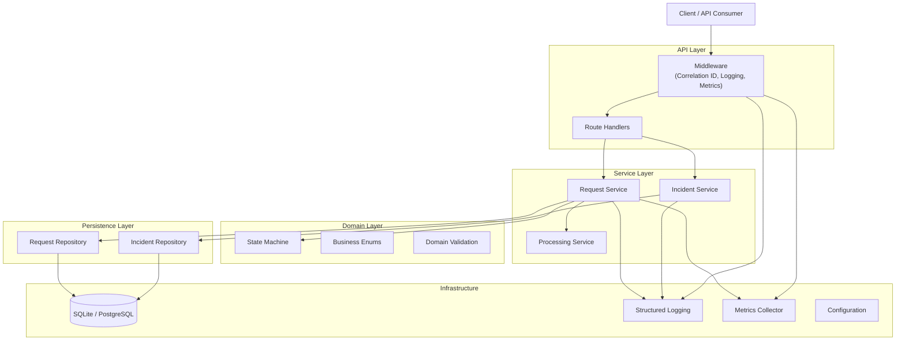
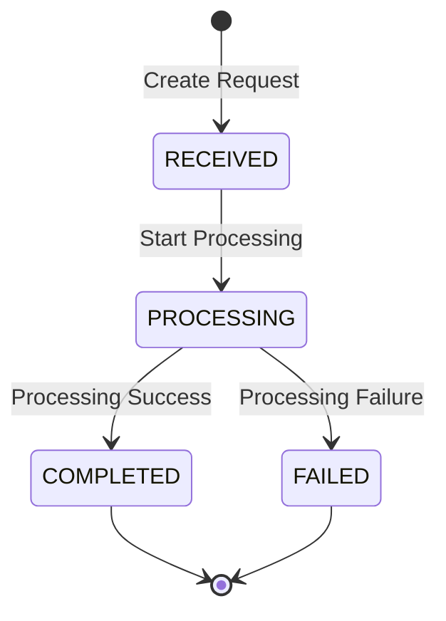
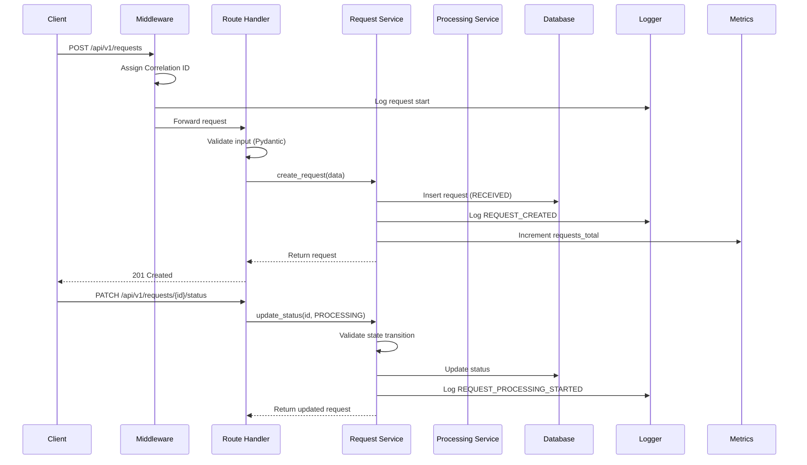
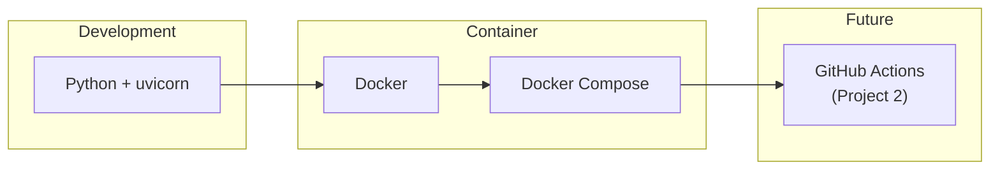

# ServicePulse — Architecture Document

**Version:** 1.0
**Last Updated:** 2025-07-08

---

## 1. System Overview

ServicePulse is a production operations and incident management platform built as a modular monolith. It processes customer service requests through a defined lifecycle, provides operational observability, and supports incident management with root cause analysis.

The system is Project 1 of a five-project Transformation Engineering portfolio and serves as the technical foundation for CI/CD (Project 2), performance optimization (Project 3), requirements traceability (Project 4), and an engineering command center (Project 5).

---

## 2. Architecture Diagram



---

## 3. Component Responsibilities

| Component | Responsibility |
|---|---|
| `api/routes/` | HTTP request/response handling. No business logic. |
| `api/dependencies.py` | FastAPI dependency injection (DB sessions, services). |
| `services/request_service.py` | Request lifecycle orchestration. |
| `services/incident_service.py` | Incident lifecycle orchestration. |
| `services/processing_service.py` | Request processing with failure simulation. |
| `domain/request.py` | Request state machine and domain rules. |
| `domain/incident.py` | Incident state machine and domain rules. |
| `domain/enums.py` | Shared business enumerations. |
| `schemas/` | Pydantic models for API input/output validation. |
| `repositories/` | Database access abstraction. |
| `db/database.py` | SQLAlchemy engine and session management. |
| `db/models.py` | ORM model definitions. |
| `core/config.py` | Centralized configuration from environment. |
| `core/logging.py` | Structured logging setup. |
| `core/errors.py` | Error types and exception handlers. |
| `core/metrics.py` | Application metrics collection. |

---

## 4. Request Lifecycle



### Valid Transitions

| From | To | Trigger |
|---|---|---|
| `RECEIVED` | `PROCESSING` | Status update or auto-processing |
| `PROCESSING` | `COMPLETED` | Successful processing |
| `PROCESSING` | `FAILED` | Processing error |

### Invalid Transitions (Rejected)

- `COMPLETED → PROCESSING`
- `FAILED → COMPLETED`
- `RECEIVED → COMPLETED`
- Any transition to `RECEIVED`

---

## 5. Data Flow



---

## 6. Error Handling Strategy

All errors are handled through a centralized exception hierarchy:

```
ServicePulseError (base)
├── ValidationError
├── NotFoundError
├── InvalidStateTransitionError
├── DatabaseError
├── ProcessingError
└── FailureSimulationError
```

FastAPI exception handlers translate these into consistent JSON responses:

```json
{
  "error": {
    "code": "REQUEST_NOT_FOUND",
    "message": "The requested service request was not found.",
    "correlation_id": "abc-123"
  }
}
```

Internal errors never expose stack traces or implementation details to API consumers.

---

## 7. Observability

| Mechanism | Implementation |
|---|---|
| **Structured Logging** | JSON-formatted logs with correlation IDs, event types, durations |
| **Metrics** | In-process counters/histograms exposed via `/api/v1/metrics` |
| **Health Checks** | `/api/v1/health` with component-level status |
| **Correlation IDs** | Auto-generated or client-supplied via `X-Correlation-ID` header |

See [Observability Document](observability.md) for details.

---

## 8. Persistence

- **ORM:** SQLAlchemy 2.0 with declarative models
- **Initial DB:** SQLite (file-based, zero-config)
- **Target DB:** PostgreSQL (no business logic changes required)
- **Pattern:** Repository pattern isolating SQL from service logic
- **Migrations:** Alembic-ready structure (migrations directory present)

The repository interface is designed so swapping SQLite → PostgreSQL requires only a `DATABASE_URL` change.

---

## 9. Deployment Model



---

## 10. Future Extension Points

| Extension | Mechanism |
|---|---|
| **PostgreSQL migration** | Change `DATABASE_URL` environment variable |
| **CI/CD pipeline** (Project 2) | GitHub Actions consuming `make` / script commands |
| **Performance optimization** (Project 3) | Replace `ProcessingService` internals; repository is isolated |
| **Requirements traceability** (Project 4) | Stable requirement IDs (`FR-XXX`) linked to tests and code |
| **Command Center dashboard** (Project 5) | Consume `/api/v1/metrics`, `/api/v1/health`, `/api/v1/incidents` |

---

## 11. Architectural Decisions

See [Engineering Decisions](engineering-decisions.md) for ADR-style records of key decisions including:

- ADR-001: Why FastAPI
- ADR-002: Why SQLite initially
- ADR-003: Why layered architecture
- ADR-004: Why API versioning
- ADR-005: Why structured logging
- ADR-006: Why metrics are decoupled from dashboard
- ADR-007: Why modular monolith
