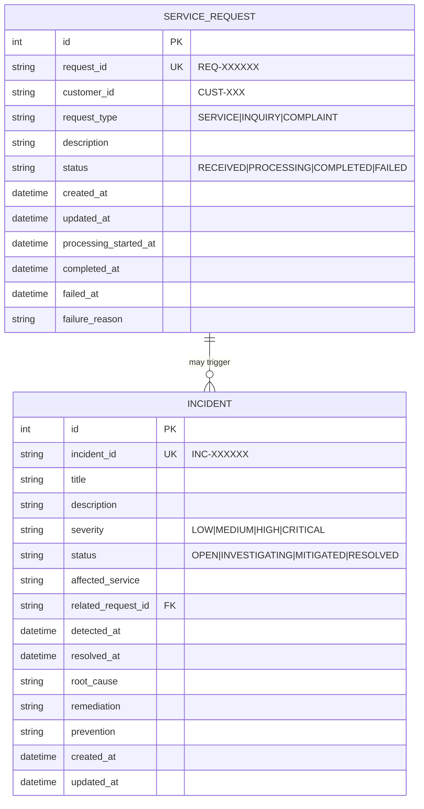

# ServicePulse — Data Model Document

**Version:** 1.0
**Last Updated:** 2025-07-08

---

## 1. Entity-Relationship Diagram

---

## 2. Entities

### 2.1 ServiceRequest

Represents a customer service request processed through the system.

| Column | Type | Constraints | Description |
|---|---|---|---|
| `id` | Integer | PK, auto-increment | Internal surrogate key |
| `request_id` | String(20) | Unique, Not Null, Indexed | Business identifier (e.g., `REQ-000001`) |
| `customer_id` | String(50) | Not Null, Indexed | Customer identifier (e.g., `CUST-001`) |
| `request_type` | String(20) | Not Null | `SERVICE`, `INQUIRY`, or `COMPLAINT` |
| `description` | String(1000) | Not Null | Free-text description |
| `status` | String(20) | Not Null, Indexed | Current lifecycle status |
| `created_at` | DateTime | Not Null | Record creation timestamp (UTC) |
| `updated_at` | DateTime | Not Null | Last modification timestamp (UTC) |
| `processing_started_at` | DateTime | Nullable | When status changed to `PROCESSING` |
| `completed_at` | DateTime | Nullable | When status changed to `COMPLETED` |
| `failed_at` | DateTime | Nullable | When status changed to `FAILED` |
| `failure_reason` | String(500) | Nullable | Reason for failure, if applicable |

**Indexes:**
- `ix_service_request_request_id` on `request_id`
- `ix_service_request_customer_id` on `customer_id`
- `ix_service_request_status` on `status`

---

### 2.2 Incident

Represents an operational incident requiring investigation and resolution.

| Column | Type | Constraints | Description |
|---|---|---|---|
| `id` | Integer | PK, auto-increment | Internal surrogate key |
| `incident_id` | String(20) | Unique, Not Null, Indexed | Business identifier (e.g., `INC-000001`) |
| `title` | String(200) | Not Null | Short incident title |
| `description` | String(2000) | Not Null | Detailed description |
| `severity` | String(20) | Not Null | `LOW`, `MEDIUM`, `HIGH`, or `CRITICAL` |
| `status` | String(20) | Not Null, Indexed | Current lifecycle status |
| `affected_service` | String(100) | Nullable | Which service is affected |
| `related_request_id` | String(20) | Nullable, Indexed | Related service request ID |
| `detected_at` | DateTime | Not Null | When the issue was detected (UTC) |
| `resolved_at` | DateTime | Nullable | When the incident was resolved (UTC) |
| `root_cause` | Text | Nullable | Root cause analysis |
| `remediation` | Text | Nullable | Steps taken to remediate |
| `prevention` | Text | Nullable | Steps to prevent recurrence |
| `created_at` | DateTime | Not Null | Record creation timestamp (UTC) |
| `updated_at` | DateTime | Not Null | Last modification timestamp (UTC) |

**Indexes:**
- `ix_incident_incident_id` on `incident_id`
- `ix_incident_status` on `status`
- `ix_incident_severity` on `severity`

---

## 3. Status Definitions

### Service Request Statuses

| Status | Description |
|---|---|
| `RECEIVED` | Request accepted and persisted |
| `PROCESSING` | Request is being actively processed |
| `COMPLETED` | Request processing finished successfully |
| `FAILED` | Request processing encountered an error |

### Incident Statuses

| Status | Description |
|---|---|
| `OPEN` | Incident created, awaiting investigation |
| `INVESTIGATING` | Engineer actively investigating |
| `MITIGATED` | Impact reduced, root cause may not be fully resolved |
| `RESOLVED` | Incident fully resolved with documented RCA |

### Incident Severities

| Severity | Description (Project-Defined) |
|---|---|
| `LOW` | Minor issue, no significant impact |
| `MEDIUM` | Moderate impact, workaround available |
| `HIGH` | Significant impact, requires prompt attention |
| `CRITICAL` | Severe impact, requires immediate response |

> **Note:** These severity definitions are project-specific and are not claimed to be industry-standard classifications.

---

## 4. Database Portability

The data model uses SQLAlchemy 2.0 declarative mappings with standard SQL types. No SQLite-specific features are used. Migration to PostgreSQL requires only updating the `DATABASE_URL` environment variable.

Column types used (`String`, `Integer`, `DateTime`, `Text`) map directly to both SQLite and PostgreSQL without modification.
